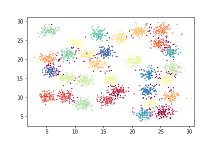

# SharedNearestNeighbors
A Shared Nearest Neighbors clustering implementation. This code is basically a wrapper of sklearn DBSCAN, implementing the neighborhood similarity as a metric.

## Examples

The implementation follows the syntax of scikit-learn clustering classes.
See example notebook for more information.

```python
from SNN import SharedNearestNeighbor as SNN
```

```python
X = np.random.rand(100,2)
snn = SNN(n_neighbors = 40,eps = 32, min_samples = 10)
y_pred = snn.fit_predict(X)
```



## References

Jarvis, R. A., & Patrick, E. A. (1973). Clustering using a similarity measure based on shared near neighbors. IEEE Transactions on computers, 100(11), 1025-1034.

Ertöz, Levent, Michael Steinbach, and Vipin Kumar. "Finding clusters of different sizes, shapes, and densities in noisy, high dimensional data." Proceedings of the 2003 SIAM international conference on data mining. Society for Industrial and Applied Mathematics, 2003.
